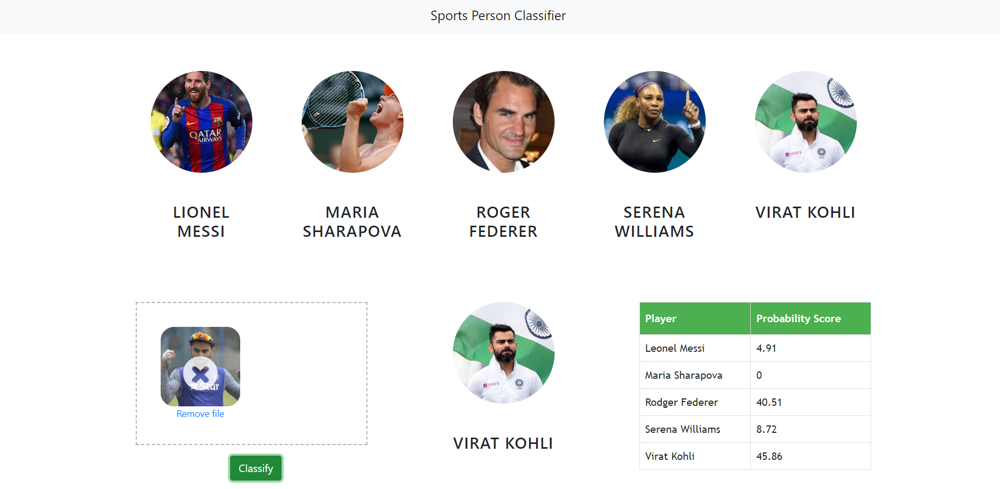

# Project-2-Sports-Person-Classifier


# Introduction -
In this data science project I walked through the process of building a Sports Person Classifier website. I first built a model using sklearn and logistic regression using images of multiple celebrities. Second step was to create a python flask server that uses the saved model to serve http requests. Third component was the website built using html, css and javascript that allows user to upload images and it calls the python flask server to retrieve the result. During model building I covered many data science concepts such as data load and cleaning, outlier detection and removal, feature engineering, gridsearchcv for hyperparameter tunning, etc. I enjoyed creating this project and I hope you like it😊

# Tools used to create the project-
1. Python
2. OpenCV for working with images
3. Numpy and pandas for data cleaning
4. Matplotlib for data visualization
5. Sklearn for model building
6. Jupyter Notebook in Visual Studio Code as IDE
7. Python flask server for http server
8. HTML/CSS/Javascript for UI

# Deploy this app to cloud (GCP VM)-

1. Create VM instance using google cloud console and allow HTTP/HTTPS incoming traffic while setting the VM.
2. Generate SSH keys using PuTTYgen, save the private key with you and upload the key under the SSH Keys section in the settings of the VM.
3. Become the root user to avoid permission errors with the command-
```
sudo su
```
4. Navigate to the following location /home and set 777 permission for the ubuntu folder-
``` 
chmod 777 ubuntu/
```
5. Update the ubuntu instance and install nginx using using the commands-
```
sudo apt-get update
sudo apt-get install nginx
```
6.  We can check whether the nginx server is running by loading the url of the instance in the browser.
7. Now login to your instance and transfer the application folder into /home/ubuntu/ (download this repo, extract it and rename the folder as SportsPersonClassifier, this folder is now your application folder😊) in the VM instance using WinSCP application.
8. Install python using the command-
```
sudo apt-get install python3-pip
```
9. Install the required python libraries using the following commands one by one-
```
sudo pip3 install Flask
sudo pip3 install opencv-python
sudo pip3 install scikit-learn
sudo pip3 install Pywavelets
```
10. Install libgl1 as it is a dependency of opencv-
```
sudo apt-get install libgl1
```
11. Navigate to the location /etc/nginx. Change the configuration of the nginx.conf file to support the upload of large sized images-
```
user www-data;
worker_processes auto;
pid /run/nginx.pid;
include /etc/nginx/modules-enabled/*.conf;

events {
        worker_connections 768;
        # multi_accept on;
}

http {

        ##
        # Basic Settings
        ##

        sendfile on;
        tcp_nopush on;
        tcp_nodelay on;
        keepalive_timeout 1800;
        types_hash_max_size 2048;
        client_max_body_size 4096M;
        fastcgi_read_timeout 1800s;
        client_body_timeout 1800s;
        client_header_timeout 1800s;
        # server_tokens off;

        # server_names_hash_bucket_size 64;
        # server_name_in_redirect off;

        include /etc/nginx/mime.types;
        default_type application/octet-stream;

        ##
        # SSL Settings
        ##

        ssl_protocols TLSv1 TLSv1.1 TLSv1.2 TLSv1.3; # Dropping SSLv3, ref: POODLE
        ssl_prefer_server_ciphers on;

        ##
        # Logging Settings
        ##

        access_log /var/log/nginx/access.log;
        error_log /var/log/nginx/error.log;

        ##
        # Gzip Settings
        ##

        gzip on;

        # gzip_vary on;
        # gzip_proxied any;
        # gzip_comp_level 6;
        # gzip_buffers 16 8k;
        # gzip_http_version 1.1;
        # gzip_types text/plain text/css application/json application/javascript text/xml application/xml application/xml+rss text/javascript;

        ##
        # Virtual Host Configs
        ##

        include /etc/nginx/conf.d/*.conf;
        include /etc/nginx/sites-enabled/*;
}


#mail {
#       # See sample authentication script at:
#       # http://wiki.nginx.org/ImapAuthenticateWithApachePhpScript
#
#       # auth_http localhost/auth.php;
#       # pop3_capabilities "TOP" "USER";
#       # imap_capabilities "IMAP4rev1" "UIDPLUS";
#
#       server {
#               listen     localhost:110;
#               protocol   pop3;
#               proxy      on;
#       }
#
#       server {
#               listen     localhost:143;
#               protocol   imap;
#               proxy      on;
#       }
#}
```
12. Navigate to the location using the command-
```
cd /etc/nginx/sites-enabled
```
13. Unlink the deafult file using the command-
```
sudo unlink default
```
14. Navigate to the location using the command-
```
cd /etc/nginx/sites-available
```
15. Now create the file named spc.conf using the following command-
```
sudo vim bhp.conf
```
16. Enter the following data in spc.conf file-
```
server {
    listen 80;
        server_name spc;
        root /home/ubuntu/SportsPersonClassifier/UI;
        index app.html;
        location /api/ {
             rewrite ^/api(.*) $1 break;
             proxy_pass http://127.0.0.1:5000;
             client_max_body_size 10M;
             proxy_temp_file_write_size 64k;
             proxy_connect_timeout 10080s;
             proxy_send_timeout 10080;
             proxy_read_timeout 10080;
             proxy_buffer_size 64k;
             proxy_buffers 16 32k;
             proxy_busy_buffers_size 64k;
             proxy_redirect off;
             proxy_request_buffering off;
             proxy_buffering off;
        }
}
```
17.  Now navigate to the following location using the command-
```
cd /etc/nginx/sites-enabled
```
18. Create the following symlink using the command-
```
sudo ln -v -s /etc/nginx/sites-available/spc.conf
```
19. Now restart the nginx server using the command-
```
sudo service nginx restart
```
20. Navigate to the location /home/ubuntu. To keep our project running even after closing the SSG(PuTTY) window we will use tmux. Enter tmux in the command line-
```
tmux
```
21. Enter the following command to start the python flask server-
```
python3 SportsPersonClassifier/server/artifacts/server.py
```
22. To exit the tmux window press Ctrl + B and then D.
23. Reload the instance link in the browser and see the magic❤️. Have fun with it 😇 Congratulations😍😊.
